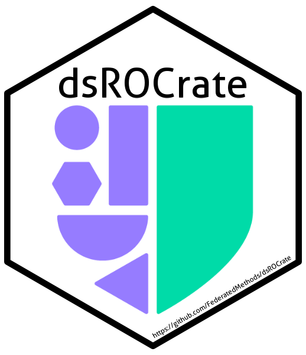
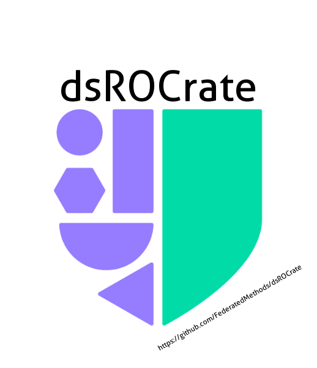
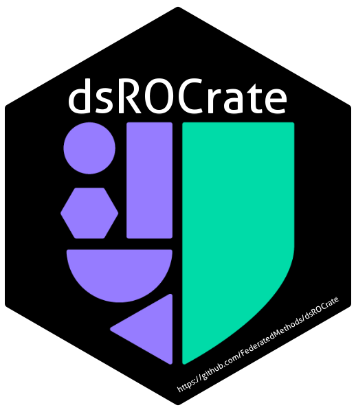

<!-- README.md is generated from README.Rmd. Please edit that file -->

# dsROCrate: ‘DataSHIELD’ RO-Crate Governance Functions 

<!-- badges: start -->

[](https://CRAN.R-project.org/package=dsROCrate)
[](https://github.com/FederatedMethods/dsROCrate/actions/workflows/R-CMD-check.yaml)
<!-- [](https://app.codecov.io/gh/FederatedMethods/dsROCrate) -->
[](https://lifecycle.r-lib.org/articles/stages.html#experimental)
<!-- badges: end -->

## Overview

`{dsROCrate}` provides tools to capture, structure and audit DataSHIELD
analyses using the RO-Crate standard. It enables reproducible governance
of federated analyses by packaging inputs, outputs, metadata, and audit
information into a consistent, portable format.

## Key Features

- Create RO-Crates for DataSHIELD workflows
- Capture project metadata, data references and analysis outputs
- Record and audit disclosure control processes
- Support reproducibility and governance in federated environments

## Installation

You can install the released version of `{dsROCrate}` from
[CRAN](https://cran.r-project.org/package=dsROCrate) with:

``` r
install.packages("dsROCrate")
```

And the development version from
[GitHub](https://github.com/FederatedMethods/dsROCrate/) with:

``` r
# install.packages("pak")
pak::pak("FederatedMethods/dsROCrate@dev")
```

## Quick Start

``` r
# open connection
con <- opalr::opal.login(
  username = "administrator",
  password = "password",
  url = "https://opal-demo.obiba.org"
)

# generate RO-Crate with Five Safes components
crate <- con |>
  # initialise RO-Crate
  dsROCrate::init(project = "CNSIM", tables = "CNSIM1", user = "dsuser") |>
  # extract Five Safes components
  dsROCrate::safe_people() |>
  dsROCrate::safe_project() |>
  dsROCrate::safe_data() |>
  dsROCrate::safe_setting() |>
  dsROCrate::safe_output()

# generate report
dsROCrate::report(crate, title = "DataSHIELD Five Safes report")
```

Alternatively, the `dsROCrate::audit()` function can be used to generate
an audit with all the Five Safes components:

``` r
proj_audit <- opalr::opal.login(
  username = "administrator",
  password = "password",
  url = "https://opal-demo.obiba.org"
) |>
  dsROCrate::audit(project = "CNSIM", tables = "CNSIM1", user = "dsuser")

# generate report
dsROCrate::report(proj_audit, title = "DataSHIELD Safe People - Audit Report")
```

## Learn More

For further details, see the following vignette:

``` r
vignette("getting-started", package = "dsROCrate")
```

## Identity

You are welcome to use any of the following hex codes when referencing
`{dsROCrate}`:

[](man/figures/logo.png)
[](man/figures/logo_white.png)
[](man/figures/logo_black.png)
